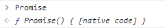

# 3. Babel

Babel은 ES6 이후의 문법을 ES5 이하의 문법으로 변환해주는 트랜스파일러이다.

## 왜 Babel을 사용해야 하나?

최근에는 대부분의 모던한 브라우저에서 ES6 이후의 문법을 지원하지만, 100%은 아니다. ECMAScript의 발전 속도와 브라우저의 지원 속도는 비례하지 않는다. 즉, 다양한 브라우저 환경에서 자바스크립트 코드가 동작하기 위해서 트랜스파일링은 필수이다.

단, ES5이하의 문법으로 변환하더라도 Promise, async/await와 같은 문법은 변환하지 못한다. 이러한 코드는 **폴리필**으로 처리해야만 한다.

## Babel의 특징 👀

-   Babel의 빌드 과정은 파싱 -> 변환 -> 출력으로 진행된다.
-   Babel은 파싱, 출력만 담당한다.
-   **변환** 과정은 **플러그인** 혹은 **프리셋**이 담당한다.
    -   (1) 플러그인 : 기능 단위로 변환에 관여한다.
        -   Ex) `@babel/plugin-transform-arrow-functions`
    -   (2) 프리셋 : 여러개의 플러그인이 모인 단위이다.
        -   추가되는 기능별로 플러그인을 매번 추가 하는 것인 번거로운 일.
        -   기능 개발에 따라 자주 업데이트 되는 프리셋을 사용하면 편하게 변환 과정을 처리할 수 있음
        -   Ex) `babel-preset-env`

## 패키지 설치

> npm i -D @babel/core @babel/cli @babel/preset-env core-js@3  
> npm i -D babel-loader  
> npm i -D @babel/plugin-transform-runtime @babel/runtime-corejs3

## .babelrc 설정

### targets

특정 타깃 브라우저에 필요한 플러그인만 사용하기 위해 설정하는 옵션이다.

### useBuiltIns

**폴리필** 적용 방법에 대한 옵션이다.

-   usage/entry 옵션 사용 시 반드시 `corejs` 프로퍼티를 명시해주어야 한다.

-   false(default) : 폴리필을 사용하지 않는다.
-   usage : 코드에서 필요한 폴리필만 로드
-   entry : 직접 core-js/stable과 regenerator-runtime/runtime 모듈을 전역 스코프에 작성이 가능한 경우에만..

```js
// .babelrc
{
	"presets": [
		[
			"@babel/preset-env",
			{
				"targets": {
					// 최근 2개의 브라우저 버전만 허용
					// ie 10버전 이하는 제외
					"browsers": ["last 2 versions", "not ie <= 10"]
				},
				"useBuiltIns": "usage",
				"corejs": 3
			}
		]
	]
}
```

### 문제1 - 전역 객체에서 폴리필 함수가 접근 가능



-   해결: `@babel/plugin-transform-runtime`

-   폴리필이 필요한 부분을 런타임 시점에서 참조할 수 있도록 변경 -> 전역 오염 방지

### 문제2 - 번들링 후 arrow function이 변환되지 않는다

-   해결 : webpack(> v5)의 output의 `environment` 속성을 부여해야 함.  
    (이후 추가적으로 리서치 후 다른 해결 방안 찾아야겠다.)

```js
// webpack.config.js
	output: {
		// ... 😎
		environment: {
			arrowFunction: false,
		},
	},
```

## 최종 설정

### .babelrc

```js
// .babelrc
{
	"presets": [
		[
			"@babel/preset-env",
			{
				"targets": {
					// 최근 2개의 브라우저 버전만 허용
					// ie 10버전 이하는 제외
					"browsers": ["last 2 versions", "not ie <= 10"]
				}
			}
		]
	],
	"plugins": [
		[
			"@babel/plugin-transform-runtime",
			{
				// https://babeljs.io/docs/en/babel-plugin-transform-runtime#corejs
				"corejs": 3,
				"proposals": true
			}
		]
	]
}

```

### webpack.config.js

```js
const path = require('path');

module.exports = {
	mode: 'none',
	entry: './src/index.js',
	output: {
		filename: 'bundle.js',
		path: path.resolve(__dirname, 'dist'),
		environment: {
			arrowFunction: false,
		},
	},
	module: {
		rules: [
			{
				test: /\.js$/,
				exclude: /node_modules/,
				use: {
					loader: 'babel-loader',
				},
			},
		],
	},
	resolve: {
		alias: {
			'@': path.resolve(__dirname, 'src'),
		},
		extensions: ['.js'],
	},
};
```

## Ref

-   https://royleej9.tistory.com/entry/babel-setting
-   https://jeonghwan-kim.github.io/series/2019/12/22/frontend-dev-env-babel.html
-   https://imch.dev/posts/babel-practice/
-   https://meetup.toast.com/posts/157
-   https://tech.kakao.com/2020/12/01/frontend-growth-02/
-   https://simsimjae.medium.com/%EA%B0%9C%EB%B0%9C%EC%9D%84-%ED%95%98%EB%8B%A4%EB%B3%B4%EB%8B%88-%EC%9D%B4%EB%9F%B0-%EC%97%90%EB%9F%AC%EA%B0%80-%EC%83%9D%EA%B2%A8%EC%84%9C-%EC%9B%90%EC%9D%B8%EC%9D%84-%EC%B0%BE%EB%8B%A4%EA%B0%80-%ED%8F%B4%EB%A6%AC%ED%95%84-%EB%AC%B8%EC%A0%9C%EB%9D%BC%EB%8A%94%EA%B1%B8-%EA%B9%A8%EB%8B%AB%EA%B3%A0-%EC%A0%95%EB%A6%AC%ED%95%A9%EB%8B%88%EB%8B%A4-217a207f8181
