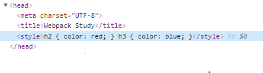

# 4. css를 위한 loader

## loader를 추가해야 하는 이유

> 웹팩은 JavaScript, JSON 파일만 인식한다. 로더를 통해 HTML, CSS, Image, Font 등과 같은 다른 유형의 파일을 모듈로 변환하여 디펜던시 그래프에 추가할 수 있다. 참고 : [Loader](./docs/../2.%20웹팩의%20주요%20속성.md)

## css-loader

-   css를 모듈로 사용하기 위한 로더

## style-loader

-   css-loader를 통해 모듈화 된 css를 `head` 태그에 주입하는 로더
-   만약, css-loader만 로더로 사용하면 css가 적용되지 않는다.

## sass-loader(optional)

-   sass를 css로 트랜스파일링 해주는 로더이다.
-   사용을 위해 `sass` 패키지도 설치해주어야 한다.

## 설치

> npm i -D sass sass-loader css-loader style-loader

## webpack.config.js

-   loader의 읽힘 순서는 `오른쪽 -> 왼쪽` 이다.
-   아래의 css 로더 설정에서 흐름은 다음과 같다.
    1. scss-loader가 css로 트랜스파일링한다.
    2. css-loader를 통해 css를 모듈로 관리한다.
    3. style-loader가 css-loader를 통해 생성 된 모듈을 `<head>` 태그에 삽입한다.

```js
{
    // ...
    module: {
		rules: [
			// ...
			{
				test: /\.s[ac]ss$/i, // sass,scss,css를 적용
				use: ['style-loader', 'css-loader', 'sass-loader'], // 로더 읽힘 순서 (오른쪽 --> 왼쪽)
			},
		],
	},
}

```

## 결과


