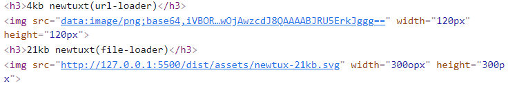

# 5. 이미지, 폰트를 위한 loader

## file-loader

-   파일(폰트, 이미지 등)을 위한 로더이다.

## url-loader

-   설정한 크기 이하의 파일을 base64를 통해 인코딩하는 로더이다.
-   설정한 크기 이상인 경우, fallback loader를 설정할 수 있다. (default: file-loader)
-   파일을 따로 생성하지 않기 때문에 네트워크 비용이 감소되지만, 번들링 크기가 커진다.

## 삽질 log..

-   url-loader를 적용 후 scss로 백그라운드 이미지 적용 시 이미지를 못 불러오는 문제
-   해결 : css-loader의 옵션에 `esModule: false`를 추가 함.. => 어떤 버그이지... url-loader랑 충돌나는 걸까?
    -   이후 리서치 예정..

## 설치

> npm i -D file-loader url-loader

## webpack.config.js

```js
{
    module: {
		rules: [
            // ..
			{
				test: /\.s[ac]ss$/i,
				use: [
					'style-loader',
                    // .. background-image error 때문에 추가한 옵션
					{ loader: 'css-loader', options: { esModule: false } },
					'sass-loader',
				],
			},
			{
				test: /\.(png|jpe?g|gif|svg)$/i,
				loader: 'url-loader', // default fallback loader는 file-loader
				options: {
					name: 'assets/[name].[ext]',
					limit: 10000, // 단위 : byte
				},
			},
		],
	},
}

```

### 결과



-   img1(< 10kb) => url-loader를 통해 base64 인코딩 되서 이미지가 불러와 짐
-   img2(>= 10kb) => url-loader limit을 넘어 fallback loader인 file-loader를 통해 이미지가 불러와 짐
